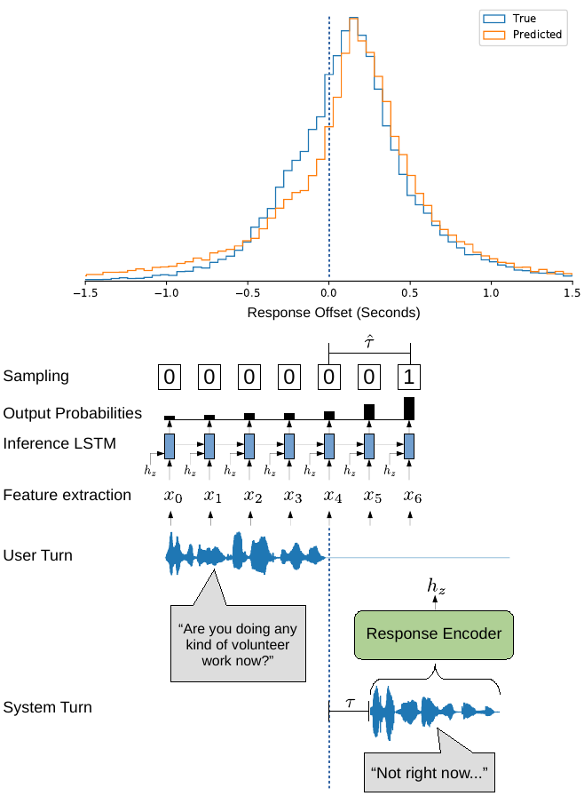

# Response Timing Networks (RTNets)



This repository contains the code for the ACL 2020 paper [Neural Generation of Dialogue Response Timings](https://arxiv.org/pdf/2005.09128.pdf).


Response timing networks (RTNets) are models that are designed to simulate naturalistic response timings in spoken dialogue systems (SDSs). In human conversations, the distribution of a given response timing depends on the semantic content of the response itself. For example, "No" responses are often delayed in comparison to "Yes" responses. The timings are also dependent on the context of the first speaker's turn. For example, speaker turns directly following a backchannel (e.g. "Uh-huh", "Yeah") have been shown to frequently occur in overlap with the backchannel. Humans are sensitive to these timings and they associate different timings with different responses. Inappropriate timings in SDSs can lead to misinterpretations, perceived rudeness, and lower impressions of the naturalness of the system. 

We propose neural models for generating these response timings in SDSs. The response timing network (RTNet) operates using both acoustic and linguistic features extracted from user and system turns. The two main components are an encoder, which encodes the system response, and an inference network, which takes a concatenation of user features and the system response encoding. RTNet operates within an incremental SDS framework where information about upcoming system responses may be available before the user has finished speaking. RTNet also functions independently of higher-level turn-taking decisions that are traditionally made by the dialogue manager (DM) component. Typically, the DM decides when the system should take a turn and also supplies the natural language generation (NLG) component with a semantic representation of the system response (e.g. intents, dialogue acts, or an equivalent neural representation). Any of the system response representations that are downstream from the DM’s output representation (e.g. lexical or acoustic features) can potentially be used to generate the response encoding. Therefore, we assume that the decision for the system to take a turn has already been made by the DM and our objective is to predict (on a frame-by-frame basis) the appropriate time to trigger the system turn. 

<!-- It may be impractical in an incremental frame-work to generate a full system response and then re-encode it using the response encoder of RTNet. To address this issue, we propose an extension of RTNet that uses a variational autoencoder (VAE) to train an interpretable latent space which can be used to bypass the encoding process at inference-time. This extension (RTNet-VAE) allows the benefit of having a data-driven neural representation of response encodings that can be manipulated without the overhead of the encoding process. This representation can be manipulated using vector algebra in a flexible manner by the DM to generate appropriate timings for a given response. -->

If you use this code or part of it, please cite the paper:
```
@inproceedings{roddy20rtnet, 
	title = {Neural Generation of Dialogue Response Timings}, 
	author = {Matthew Roddy and Naomi Harte}, 
	booktitle = {Annual Conference of the Association for Computational Linguistics (ACL)}, 
	month = {July}, 
	year = {2020} 
}
```

## Requirements 

### Data

The experiments require the following corpora:

- Switchboard-1 Release 2 (swb1_LDC97S62.tgz)
- NXT Switchboard Annotations (LDC2009T26.tgz)
- [Switchboard ISIP transcripts](https://www.isip.piconepress.com/projects/switchboard/releases/switchboard_word_alignments.tar.gz)

Please place all the tar balls for the corpora in a folder called ```/raw_data``` somewhere on your system. The path to this folder will be set in the instructions below.

### Tools

- Linux
- Approximately 180 GB disk space for feature extraction
- GPUs with at least 16 GB memory in total. We used two RTX2080s per training run.
- Sox v14.4
- OpenSmile-2.3.0

### Python

- python==3.7.3 (presumably works for all versions >=3.7)
- PyTorch v==1.2.0 (later versions break the code)
- The other requirements are installed below in the setup instructions.

## Setup

```bash
git clone https://github.com/mattroddy/RTNets
cd ./RTNets
pip install -r requirements.txt
python -m spacy download en_core_web_md
```

In ```paths.sh``` set ```RAW_DATA_DIR``` to your ```/raw_data``` path

Download the opensmile tarball from from https://www.audeering.com/opensmile/ and place it in ```RTNet/tools/```
```
source ./paths.sh
sh ./scripts/get_wavs.sh
sh ./scripts/setup_opensmile.sh
tar -C $RAW_DATA_DIR -xvzf $RAW_DATA_DIR/switchboard_word_alignments.tar.gz
tar -C $RAW_DATA_DIR -xvzf $RAW_DATA_DIR/LDC2009T26.tgz
python setup.py
```

## Running the code

At this point a model can be trained by running:
```bash
python run.py 
```
To get the BCE test loss of the trained model:
```bash
python run.py --just_test --just_test_fold <path_to_model_folder>
```
To perform sampling on the test set and calculate the mean-absolute offset error (MAE) run:
```bash
python run.py --just_test --full_test --just_test_fold <path_to_model_folder>
```

## Reproducing the results

The full list of the training and testing commands used to reproduce the results in Table 1 of the ACL paper can be found in ```experiments.sh```. The comments include instructions on which flags to use. Each of the models takes approximately two days to train using two RTX2080 GPUs.

## Pretrained Model

Pretrained weights for the full model (row 1 of Table 1) are available [here](https://www.dropbox.com/sh/mvzfmso6mr4brdz/AAAXg8BASlffpydhQBG6FpiPa?dl=0).
